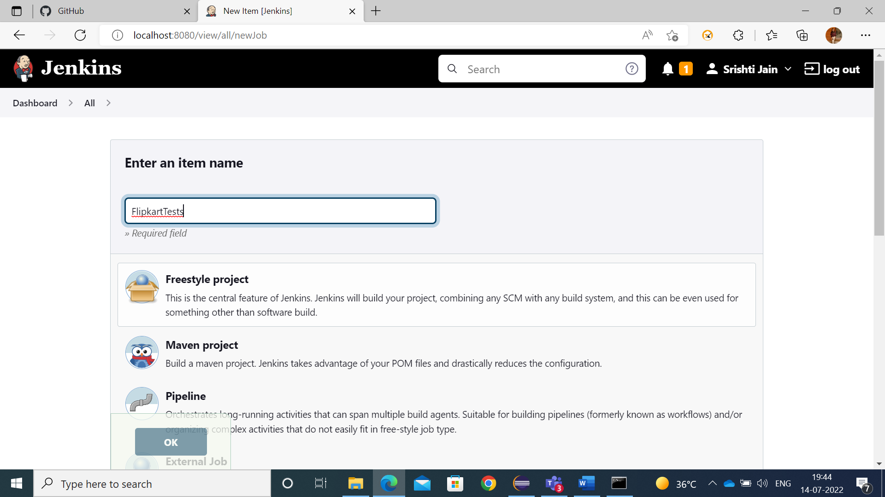
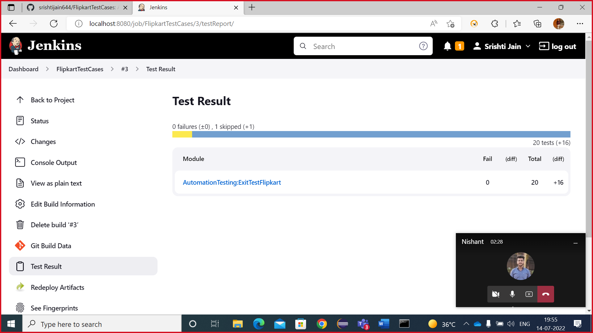

# Flipkart Website Automation Suite Information:

##### To run the test cases from command line -
* open the project location where pom file is placed
* open cmd for that path
* run command mvn test or mvn clean install

#### Testng files description
* testng.xml: define the tests related to different pages across the site

#### Packages description
* com.ExitTestFlipkart.Pages- Defining all the pages actions and the respective object repository.
* com.ExitTestFlipkart.utils- Defining all the utilities needed for the tests.
* com.ExitTestFlipkart.tests- Defining all the pages tests and assertions.

#### Tests.java files description
**BaseTest** : The main class which defines-
* @BeforeMethod- to open the browser, to open url and get the name of the test
* @AfterMethd- to attach screenshot and to quit the browser
* @BeforeSuite- to set Extent
* @AfterSuite- to end the report

**FirstLoginThenOtherOperation** : logout , visit profile , super coin zone and clicking my cupons 
 
**HomePageTests** : top offers, mobiles, flipkart logo, flipkart stories, facebook, become a seller, hover over electronics and click gaming

**loginTest** : check with valid and invalid number and password

**MoreOptionTest** : hover over more option and clicking notification preference and customer service

**ProductPageTest**: searching an item, applying filter and adding an item to cart

**travelTest** : enter valid and invalid fromlocation and to location

## Important Note

- To change browser - change the browser in config.properties
 available drivers - chrome, firefox, microsoftedge, internet explorer
- To change mode - change the driver mode in config.properties
mode -  headless, non-headless
- 1 test case will be skipped because in excel sheet execution required is set as no.

## Important Directory

- Drivers : ./Drivers/
- Report File : ./Reports/ExtentReports.html
- Log File : ./output/logs/
- Configuration File: ./Resources/config.properties
- Screenshots Folder: ./FailedTestsScreenshots/
- Test Data File : ./TestDataSheet/TestData.xlsx

## How to run

- Clone repo from the github link
- gitHub link :- **https://github.com/srishtijain644/FlipkartTestCases.git**

## How to run through jenkins

- download jenkins.war file
- run in cmd 

```
java -jar jenkins.war --httpPort=8080
```

- setup jenkins

### Screenshots

#### Jenkins Setup 




#### Jenkins Final


#### Jenkins TestResult



#### Reports and Screenshots
* Extent report gets generated after the run under ./Reports/ExtentReports.html.
* TestNG report as "emailable-report.html" gets generated under /test-output.
* Failed Screenshots gets placed under /FailedScreenshots


